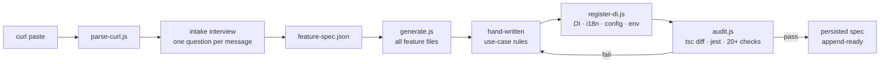
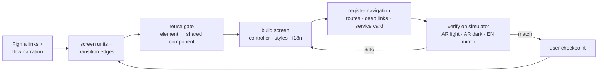
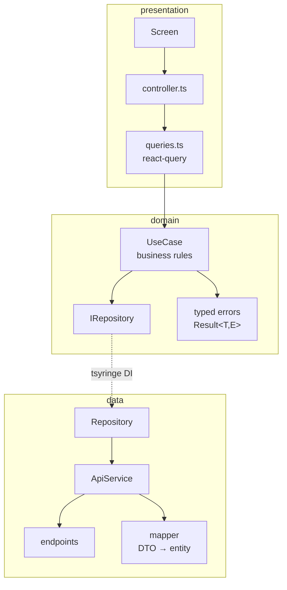

# react-clean-architecture

> An [Agent Skill](https://platform.claude.com/docs/en/agents-and-tools/agent-skills/overview) that scaffolds **complete clean-architecture features** in a React Native (Expo) app from a single curl paste — and builds their **pixel-accurate screens from Figma**, verified live on the iOS simulator.

    

Works with **Claude Code**, **Cursor**, **OpenAI Codex CLI**, and any agent that reads `AGENTS.md` / Markdown skills. One [install script](#install), three tools.

---

## What it does

Paste a curl. The skill interviews you (one question per message), writes a small `feature-spec.json`, and then **deterministic Node scripts** — not the LLM — generate every file, wire the DI container, i18n, react-query keys, config and env files, and audit the result against a TypeScript baseline and Jest.

```
src/features/<Feature>/
├── data/          dtos · endpoints · mappers · service (+ its interface) · repository
├── domain/        entities · errors · repositories (interfaces) · use-cases
├── presentation/  screens + controllers · styles · queries · translations (en/ar)
├── test/          mapper + use-case Jest suites (+ render tests in the design lane)
└── feature-spec.json   (sanitized, persisted — powers append/remove/rename/migrate)
```

### Why script-driven?

**Accuracy and low token usage.** The LLM hand-writes only the spec and the use-case business rules. Everything mechanical is done by dependency-free Node scripts whose code never enters the context window — only their compact output does. Generation is idempotent (anchor comments), never overwrites, and refuses bad specs up front.

---

## The pipeline



### Three modes

| Mode | Backend slice | Figma screens | When |
|---|---|---|---|
| **Full** | ✅ | ✅ | new feature, endpoint + designs ready |
| **Backend only** | ✅ | — | API first, screens later |
| **Design only** | — | ✅ | screens for an existing/legacy feature |

Any backend mode can also run with a **mock backend** (`"mock": true` — say "use mock backend"
/ "API not ready"): the generator emits a `<Feature>MockService` whose sample DTOs flow
through the **real mappers**, and the DI container serves it with a one-line swap comment for
when the real API lands. Screens, queries, and tests never know they're mocked.

### The design lane (full / design modes)

Screens are built by the agent from Figma links following strict rules ([DESIGN.md](skills/react-clean-architecture/DESIGN.md)) — theme tokens only, shared-component reuse gate (backed by a COMPONENTS.md **drift detector** in the audit), Arabic-first RTL — then **verified on the iOS simulator** before sign-off. When `idb` is present (the installer sets it up automatically), verification is **interactive**: real taps drive every flow transition, filter, and pager — not just screenshots.



### Generated architecture (backend slice)



The dependency rule is **enforced, not aspirational**: `domain/` never imports `data/` (DTOs
stay behind `mapper.toDTO` inside the service — interfaces take domain inputs), and the audit's
FAIL-level `arch-boundaries` check blocks any hand-edit that crosses a layer. Use-case errors
carry a real taxonomy (`AUTH_ERROR`, `TIMEOUT`, `VALIDATION_ERROR`, …) instead of collapsing
every failure to `NETWORK_ERROR`.

---

## Install

### Universal (any agent, user-wide) — recommended

```bash
npx skills@latest add Mkhira/react-clean-architecture
```

Pick your agent when prompted (Claude Code, Cursor, Windsurf, Codex, …) — it installs into the right place automatically. The skill lives at [`skills/react-clean-architecture/`](skills/react-clean-architecture/) in the standard Agent-Skills layout.

> This path installs the skill files only — it never runs `install.sh`, so follow up with the
> [touch-tools step](#simulator-touch-tools-idb) to get tap-driven verification.

### Claude Code — native plugin

```
/plugin marketplace add Mkhira/react-clean-architecture
/plugin install react-clean-architecture@react-clean-architecture
```

> Skill files only — follow up with the [touch-tools step](#simulator-touch-tools-idb).

### install.sh (clone first)

```bash
git clone https://github.com/Mkhira/react-clean-architecture.git
cd react-clean-architecture
```

| Tool | User-wide (main skill) | One project |
|---|---|---|
| **Claude Code** | `./install.sh claude` → `~/.claude/skills/` | `./install.sh claude --project <app>` |
| **Cursor** | `./install.sh cursor` → `~/.cursor/skills/` | `./install.sh cursor --project <app>` (+ routing rule in `.cursor/rules/`) |
| **Codex CLI** | `./install.sh codex` → `~/.codex/skills/` + `~/.codex/AGENTS.md` | `./install.sh codex --project <app>` (+ `AGENTS.md` block) |
| Any `AGENTS.md` agent | — | `./install.sh agents --project <app>` |

Re-running is safe: symlinks are refreshed, copies are replaced, and `AGENTS.md` blocks are updated between markers instead of duplicated. Every `install.sh` target also runs the [touch-tools step](#simulator-touch-tools-idb) automatically (`--no-tools` skips it).

### Simulator touch tools (idb)

The design lane verifies screens **with real taps** (`idb ui tap/text` — every flow transition, filter, and pager exercised on the simulator) when [idb](https://fbidb.io) is installed. `install.sh` sets it up automatically on macOS; if you installed via `npx skills`, the plugin marketplace, or a manual copy, run the tools-only target once:

```bash
./install.sh tools        # from a clone of this repo
```

What it installs and how:

| Piece | With Homebrew | Without Homebrew |
|---|---|---|
| `idb_companion` (native daemon — the part that injects touches) | `brew tap facebook/fb && brew install facebook/fb/idb-companion` | prebuilt `idb-companion.universal.tar.gz` from the [GitHub release](https://github.com/facebook/idb/releases) into `~/.local` (no sudo) behind an exec wrapper |
| `idb` CLI (Python client) | `pipx install fb-idb` (retries pinned to the system Python if pipx's default interpreter is broken) | `python3 -m pip install --user fb-idb` (system Python ships with the Xcode CLT) |

Homebrew itself is **never** auto-installed. Every step is non-fatal — if anything fails, the design lane falls back to screenshot-only verification and says so. Not on PATH after install? `export PATH="$HOME/.local/bin:$HOME/Library/Python/*/bin:$PATH"`.

### Manual

Copy `skills/react-clean-architecture/` wherever your tool discovers skills, e.g.:

```bash
cp -R skills/react-clean-architecture ~/.claude/skills/
```

`SKILL.md` carries standard Agent-Skills frontmatter (`name`, `description`), so any compatible runtime indexes it automatically.

### Usage

Inside the target app repo, ask your agent:

> Create a **TaxValidation** feature from this curl: `curl -X POST https://…`

or before the backend exists:

> `/react-clean-architecture` create new feature applicationStatus — **use mock backend for now**

or for screens only:

> `/react-clean-architecture` I need to append on src/features/TaxStampValidation — design mode only

The agent walks the checklist in [SKILL.md](skills/react-clean-architecture/SKILL.md): intake → test-infra check (auto-installs `@testing-library/react-native` on first run) → confirmation tables → generate → register → audit → (design lane) → final report. Appending an endpoint or a screen to a feature the skill built earlier is automatic — the persisted spec provides full prior context, no re-asking. The mock-backend lane generates a `MockService` behind the real service interface; swapping to the live API later is a one-line DI change (the swap comment is generated with it).

---

## Documentation map

| Doc | Contents |
|---|---|
| [SKILL.md](skills/react-clean-architecture/SKILL.md) | the agent's entry point — workflow router, progress checklist, intake protocol |
| [DESIGN.md](skills/react-clean-architecture/DESIGN.md) | design lane: screen collection, Figma → screens → simulator verification loop, RTL ground rules, navigation registration |
| [APPEND.md](skills/react-clean-architecture/APPEND.md) | endpoint-append lane: persisted-spec reuse, behavior table, append user-story rule |
| [LIFECYCLE.md](skills/react-clean-architecture/LIFECYCLE.md) | remove / rename / migrate a skill-generated feature |
| [SPEC_FORMAT.md](skills/react-clean-architecture/SPEC_FORMAT.md) | `feature-spec.json` schema + collision rules |
| [AUDIT.md](skills/react-clean-architecture/AUDIT.md) | every audit check and how to fix each failure |
| [TOKEN_MAP.md](skills/react-clean-architecture/TOKEN_MAP.md) | Figma px/hex/variable → theme-token mapping used by the design lane |
| [COMPONENTS.md](skills/react-clean-architecture/COMPONENTS.md) | shared-components dictionary (props, variants, gotchas) used by the reuse gate — kept honest by the `components-md` drift check in the audit |
| [docs/decisions.md](skills/react-clean-architecture/docs/decisions.md) | decision & live-finding history (not loaded during runs) |
| [CHANGELOG.md](CHANGELOG.md) | what changed in each version, with the live-run findings that drove it |
| [examples/](skills/react-clean-architecture/examples/) | filled spec + full expected output tree |
| [evals/](skills/react-clean-architecture/evals/) | end-to-end eval scenarios against a real repo copy |

## Scripts reference

| Script | Job |
|---|---|
| `scripts/parse-curl.js` | tolerant curl/Postman paste → structured JSON |
| `scripts/json-to-dto.js` | sample JSON → TypeScript DTO declarations |
| `scripts/generate.js` | spec → every feature file (validates spec; never overwrites; append via anchors) |
| `scripts/register-di.js` | DI + i18n + config + 6 env files, idempotent |
| `scripts/register-navigation.js` | design lane's navigation registration (routes, page registry, SERVICES_DATA, deep links, translations placeholders), idempotent |
| `scripts/audit.js` | tsc-baseline diff · jest · arch-boundaries · structure/DI/env/secret checks (`--baseline`, `--persist-spec`) |
| `scripts/rollback.js` | manifest-scoped undo — dry-run plan, `--apply` to execute |
| `scripts/setup-test-infra.js` | auto-installs `@testing-library/react-native`, creates/wires `jest.setup.js` (`--check` for report-only) |
| `scripts/check-components-md.js` | COMPONENTS.md drift detector — DRIFT/STALE vs `src/shared/components` (`--strict`) |
| `scripts/remove-feature.js` | delete a merged feature everywhere (dir + DI + i18n + config + env) |
| `scripts/rename-feature.js` | rename across code/DI/i18n/config/env via derived identifiers only |
| `scripts/migrate-feature.js` | upgrade machine-owned files to current templates; hand-written code preserved |

Paths are relative to [`skills/react-clean-architecture/`](skills/react-clean-architecture/). All scripts run on plain Node ≥ 18 (stdlib only) and support `--help`.

## Testing the skill itself

135 tests on Node's built-in runner — still zero dependencies:

```bash
node --test skills/react-clean-architecture/tests/*.test.js
```

Unit suites cover the parsers, generation scenarios (create/append/never-overwrite/anchors), DI wiring idempotency and collision refusal, every audit check driven to PASS and FAIL, lifecycle scripts, plus aggressive/hostile-input suites. The fixture repos in `tests/helpers.js` mirror the real app files, so the scripts' regexes hit realistic targets. `evals/` covers the tsc-diff and jest steps end-to-end.

## Requirements

- A repo following the zatcaReact conventions: tsyringe `TOKENS`/`TokenRegistry`, `Result<T, E>`, `AppError`-style typed errors, `IHttpClient`, i18next `featureTranslations`, `@core`/`@features`/`@shared` path aliases, jest-expo.
- Node ≥ 18. The design lane additionally needs the Figma MCP server and a booted iOS simulator.
- `install.sh` also auto-installs **idb** for tap-driven simulator verification (Homebrew tap
  `facebook/fb`, or the prebuilt GitHub-release companion when Homebrew is absent — Homebrew
  itself is never auto-installed; `--no-tools` skips).

## Secret handling

Real env values land only in `.env` + `.env.development`; the committed env files get placeholders. Persisted specs are sanitized (`<env:KEY>`). The audit fails on real-looking values in `.env.example` or raw secrets in generated code. Session/Bearer headers are never emitted — the HttpClient auth layer owns them, and runtime tokens (curl execution, simulator login) never touch a file.

## Out of scope

- Upload/multipart endpoints (use `IHttpClient.upload()` manually)
- Backend-only mode leaves expo-router wiring to you (full/design modes register navigation automatically)
- Removing/renaming/migrating **pre-skill** features (no persisted spec — manual)

## License

[MIT](LICENSE)
