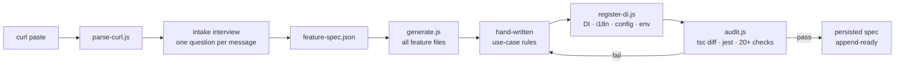
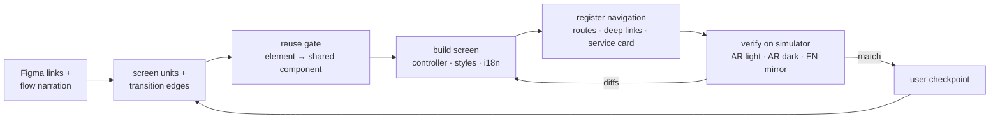
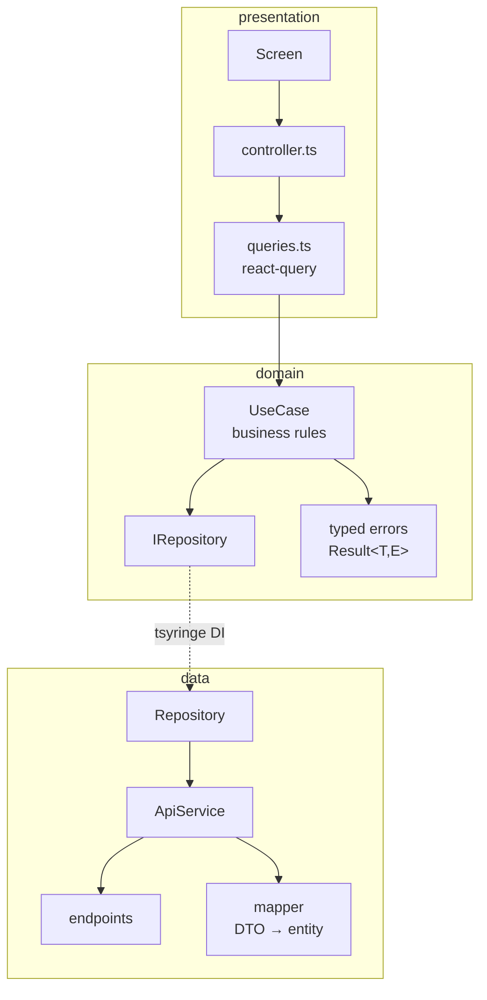

# react-clean-architecture

> An [Agent Skill](https://platform.claude.com/docs/en/agents-and-tools/agent-skills/overview) that scaffolds **complete clean-architecture features** in a React Native (Expo) app from a single curl paste — and builds their **pixel-accurate screens from Figma**, verified live on the iOS simulator.

    

Works with **Claude Code**, **Cursor**, **OpenAI Codex CLI**, and any agent that reads `AGENTS.md` / Markdown skills. One [install script](#install), three tools.

---

## What it does

Paste a curl. The skill interviews you (one question per message), writes a small `feature-spec.json`, and then **deterministic Node scripts** — not the LLM — generate every file, wire the DI container, i18n, react-query keys, config and env files, and audit the result against a TypeScript baseline and Jest.

```
src/features/<Feature>/
├── data/          dtos · endpoints · mappers · service · repository
├── domain/        entities · errors · IRepositories · IServices · use cases
├── presentation/  screens + controllers · styles · queries · translations (en/ar)
├── test/          mapper + use-case Jest suites
└── feature-spec.json   (sanitized, persisted — powers append/remove/rename/migrate)
```

### Why script-driven?

**Accuracy and low token usage.** The LLM hand-writes only the spec and the use-case business rules. Everything mechanical is done by dependency-free Node scripts whose code never enters the context window — only their compact output does. Generation is idempotent (anchor comments), never overwrites, and refuses bad specs up front.

---

## The pipeline



### Three modes

| Mode | Backend slice | Figma screens | When |
|---|---|---|---|
| **Full** | ✅ | ✅ | new feature, endpoint + designs ready |
| **Backend only** | ✅ | — | API first, screens later |
| **Design only** | — | ✅ | screens for an existing/legacy feature |

### The design lane (full / design modes)

Screens are built by the agent from Figma links following strict rules ([DESIGN.md](DESIGN.md)) — theme tokens only, shared-component reuse gate, Arabic-first RTL — then **verified on the iOS simulator** in three passes before sign-off.



### Generated architecture (backend slice)



---

## Install

Clone, then run the installer for your tool:

```bash
git clone https://github.com/Mkhira/react-clean-architecture.git
cd react-clean-architecture
```

| Tool | Command | What it does |
|---|---|---|
| **Claude Code** (user-wide) | `./install.sh claude` | symlink into `~/.claude/skills/` |
| **Claude Code** (one project) | `./install.sh claude --project /path/to/app` | symlink into `<app>/.claude/skills/` |
| **Cursor** | `./install.sh cursor --project /path/to/app` | copies the skill into `<app>/.cursor/skills/` + adds a `.cursor/rules/*.mdc` rule that routes feature-scaffolding requests to `SKILL.md` |
| **Codex CLI** | `./install.sh codex --project /path/to/app` | copies the skill into `<app>/.agent-skills/` + appends a routed section to the project's `AGENTS.md` |
| Any `AGENTS.md` agent | `./install.sh agents --project /path/to/app` | same as codex — the `AGENTS.md` convention is tool-agnostic |

Re-running is safe: symlinks are refreshed, copies are replaced, and the `AGENTS.md` block is updated between markers instead of duplicated.

> **Manual install** is just as valid: put this folder wherever your tool discovers skills and make sure the agent reads [SKILL.md](SKILL.md) when the user asks to scaffold a feature. `SKILL.md` carries standard Agent-Skills frontmatter (`name`, `description`) so any compatible runtime can index it.

### Usage

Inside the target app repo, ask your agent:

> Create a **TaxValidation** feature from this curl: `curl -X POST https://…`

or for screens only:

> `/react-clean-architecture` I need to append on src/features/TaxStampValidation — design mode only

The agent walks the checklist in [SKILL.md](SKILL.md): intake → confirmation tables → generate → register → audit → (design lane) → final report. Appending an endpoint or a screen to a feature the skill built earlier is automatic — the persisted spec provides full prior context, no re-asking.

---

## Documentation map

| Doc | Contents |
|---|---|
| [SKILL.md](SKILL.md) | the agent's entry point — full workflow, progress checklist, intake protocol, append mode |
| [DESIGN.md](DESIGN.md) | design lane: Figma → screens → simulator verification loop, RTL ground rules, navigation registration |
| [SPEC_FORMAT.md](SPEC_FORMAT.md) | `feature-spec.json` schema + collision rules |
| [AUDIT.md](AUDIT.md) | every audit check and how to fix each failure |
| [COMPONENTS.md](COMPONENTS.md) | shared-components dictionary (props, variants, gotchas) used by the reuse gate |
| [TOKEN_MAP.md](TOKEN_MAP.md) | Figma px/hex/variables → theme token mapping |
| [CHANGELOG.md](CHANGELOG.md) | version history |
| [examples/](examples/) | filled spec + full expected output tree |
| [evals/](evals/) | end-to-end eval scenarios against a real repo copy |

## Scripts reference

| Script | Job |
|---|---|
| `scripts/parse-curl.js` | tolerant curl/Postman paste → structured JSON |
| `scripts/json-to-dto.js` | sample JSON → TypeScript DTO declarations |
| `scripts/generate.js` | spec → every feature file (validates spec; never overwrites; append via anchors) |
| `scripts/register-di.js` | DI + i18n + config + 6 env files, idempotent |
| `scripts/audit.js` | tsc-baseline diff · jest · structure/DI/env/secret checks (`--baseline`, `--persist-spec`) |
| `scripts/rollback.js` | manifest-scoped undo — dry-run plan, `--apply` to execute |
| `scripts/remove-feature.js` | delete a merged feature everywhere (dir + DI + i18n + config + env) |
| `scripts/rename-feature.js` | rename across code/DI/i18n/config/env via derived identifiers only |
| `scripts/migrate-feature.js` | upgrade machine-owned files to current templates; hand-written code preserved |

All scripts run on plain Node ≥ 18 (stdlib only) and support `--help`.

## Testing the skill itself

106 tests on Node's built-in runner — still zero dependencies:

```bash
node --test tests/*.test.js
```

Unit suites cover the parsers, generation scenarios (create/append/never-overwrite/anchors), DI wiring idempotency and collision refusal, every audit check driven to PASS and FAIL, lifecycle scripts, plus aggressive/hostile-input suites. The fixture repos in `tests/helpers.js` mirror the real app files, so the scripts' regexes hit realistic targets. `evals/` covers the tsc-diff and jest steps end-to-end.

## Requirements

- A repo following the zatcaReact conventions: tsyringe `TOKENS`/`TokenRegistry`, `Result<T, E>`, `AppError`-style typed errors, `IHttpClient`, i18next `featureTranslations`, `@core`/`@features`/`@shared` path aliases, jest-expo.
- Node ≥ 18. The design lane additionally needs the Figma MCP server and a booted iOS simulator.

## Secret handling

Real env values land only in `.env` + `.env.development`; the committed env files get placeholders. Persisted specs are sanitized (`<env:KEY>`). The audit fails on real-looking values in `.env.example` or raw secrets in generated code. Session/Bearer headers are never emitted — the HttpClient auth layer owns them, and runtime tokens (curl execution, simulator login) never touch a file.

## Out of scope

- Upload/multipart endpoints (use `IHttpClient.upload()` manually)
- Backend-only mode leaves expo-router wiring to you (full/design modes register navigation automatically)
- Removing/renaming/migrating **pre-skill** features (no persisted spec — manual)

## License

[MIT](LICENSE)
