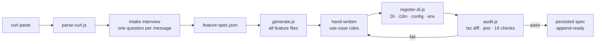
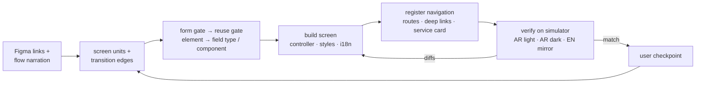
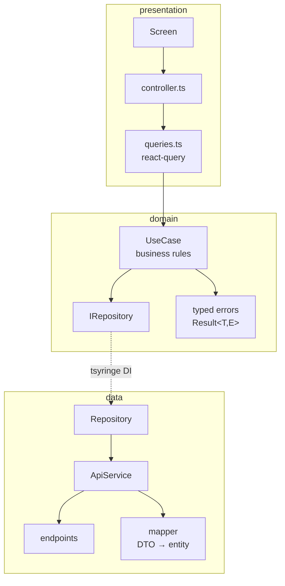

# react-clean-architecture

> An [Agent Skill](https://platform.claude.com/docs/en/agents-and-tools/agent-skills/overview) that scaffolds **complete clean-architecture features** in a React Native (Expo) app from a single curl paste — and builds their **pixel-accurate screens from Figma**, verified live on the iOS simulator.

    

Works with **Claude Code**, **Cursor**, **OpenAI Codex CLI**, and any agent that reads `AGENTS.md` / Markdown skills. One [install script](#install), three tools.

---

## What it does

Paste a curl. The skill interviews you (one question per message), writes a small `feature-spec.json`, and then **deterministic Node scripts** — not the LLM — generate every file, wire the DI container, i18n, react-query keys, config and env files, and audit the result against a TypeScript baseline and Jest.

```
src/features/<feature-dir>/          kebab-case directory; identifiers stay PascalCase
├── data/          dtos · endpoints · mappers · IServices (contract) · service · repository
├── domain/        entities · constants (when an endpoint has a statusEnum) · errors · IRepositories · use-cases
├── presentation/  screens + controller · styles · queries · translations (en/ar) · components · utils
├── test/          mapper + use-case Jest suites (+ design-lane render tests) — or __tests__/
└── feature-spec.json   (sanitized, persisted — powers append/remove/rename/migrate)
```

### Why script-driven?

**Accuracy and low token usage.** The LLM hand-writes only the spec and the use-case business rules. Everything mechanical is done by dependency-free Node scripts whose code never enters the context window — only their compact output does. Generation is idempotent (anchor comments), never overwrites, and refuses bad specs up front.

The long reference documents work the same way. The shared-component dictionary and the form-builder API are **retrieved by section** (`scripts/components.js`, `scripts/formref.js`) instead of being read whole, and the phase-specific docs — endpoint intake, review conventions, the design lane — load when their phase starts. Sections come back byte-identical to the file and `--all` prints everything: this changes *when* a document is read, never how much of it the agent is allowed to read.

---

## The pipeline



### Three modes

| Mode | Backend slice | Figma screens | When |
|---|---|---|---|
| **Full** | ✅ | ✅ | new feature, endpoint + designs ready |
| **Backend only** | ✅ | — | API first, screens later |
| **Design only** | — | ✅ | screens for an existing/legacy feature |

Any backend mode can also run with a **mock backend** (`"mock": true` — say "use mock backend"
/ "API not ready"): the generator emits a `<Feature>MockService` whose sample DTOs flow
through the **real mappers**, and the DI container serves it with a one-line swap comment for
when the real API lands. Screens, queries, and tests never know they're mocked.

### The design lane (full / design modes)

Screens are built by the agent from Figma links following strict rules ([DESIGN.md](skills/react-clean-architecture/DESIGN.md)) — theme tokens only, a **form-first gate** (any screen collecting input for a submission is a form-builder config array, never hand-wired inputs — [FORMS.md](skills/react-clean-architecture/FORMS.md)), a shared-component reuse gate (backed by a COMPONENTS.md **drift detector** in the audit), Arabic-first RTL — then **verified on the iOS simulator** before sign-off. When `idb` is present (the installer sets it up automatically), verification is **interactive**: real taps drive every flow transition, filter, and pager — not just screenshots.



### Generated architecture (backend slice)



The dependency rule is **enforced, not aspirational**: `domain/` never imports `data/` (DTOs
stay behind `mapper.toDTO` inside the service — interfaces take domain inputs), and the audit's
FAIL-level `arch-boundaries` check blocks any hand-edit that crosses a layer.

Use cases classify transport failures across the app-wide `AppError` codes (`AUTH_ERROR`,
`TIMEOUT`, `VALIDATION_ERROR`, `NETWORK_ERROR`) instead of collapsing everything to
`NETWORK_ERROR` — the feature error type reuses `AppError` as-is rather than widening it or
inventing feature-local codes. Every use case takes an `ILogger` and logs the exception before
returning `Result.err`, and a declared `statusEnum` becomes `domain/constants/<featureCamel>.ts`, the
one source the entity, mappers, mock catalogs and filter options all import.

The conventions PR reviewers used to catch by hand are a FAIL-level **`review-conventions`**
audit check: kebab-case feature directory, no dead pre-1.11 folders, no widened `AppError`, no
enum literal array retyped across files, theme tokens only in `styles.ts`, no presentation
module nothing imports.

---

## Install

### Universal (any agent, user-wide) — recommended

```bash
npx skills@latest add Mkhira/react-clean-architecture
```

Pick your agent when prompted (Claude Code, Cursor, Windsurf, Codex, …) — it installs into the right place automatically. The skill lives at [`skills/react-clean-architecture/`](skills/react-clean-architecture/) in the standard Agent-Skills layout.

This installs it **as a skill**, which is how it is meant to be used: it appears as `/react-clean-architecture`, and the agent also picks it up on its own from a plain request ("create a feature from this curl…"). Every install below except the plugin one does the same.

> This path installs the skill files only — it never runs `install.sh`, so follow up with the
> [touch-tools step](#simulator-touch-tools-idb) to get tap-driven verification.

### Claude Code — native plugin (alternative)

Run these as **two separate commands**, not one line — the second is not part of the first's argument:

```
/plugin marketplace add Mkhira/react-clean-architecture
```

```
/plugin install react-clean-plugin@react-clean-architecture
```

> Plugin skills are namespaced `<plugin>:<skill>`, so this install is
> `/react-clean-plugin:react-clean-architecture` (the plugin is `react-clean-plugin`, the
> skill inside it keeps its name). Same files, same behavior as the skill install above; pick
> this one when you want `/plugin update` to manage it.

> Skill files only — follow up with the [touch-tools step](#simulator-touch-tools-idb).

### install.sh (clone first)

```bash
git clone https://github.com/Mkhira/react-clean-architecture.git
cd react-clean-architecture
```

| Tool | User-wide (main skill) | One project |
|---|---|---|
| **Claude Code** | `./install.sh claude` → `~/.claude/skills/` | `./install.sh claude --project <app>` |
| **Cursor** | `./install.sh cursor` → `~/.cursor/skills/` | `./install.sh cursor --project <app>` (+ routing rule in `.cursor/rules/`) |
| **Codex CLI** | `./install.sh codex` → `~/.codex/skills/` + `~/.codex/AGENTS.md` | `./install.sh codex --project <app>` (+ `AGENTS.md` block) |
| Any `AGENTS.md` agent | — | `./install.sh agents --project <app>` |

Re-running is safe: symlinks are refreshed, copies are replaced, and `AGENTS.md` blocks are updated between markers instead of duplicated. `--copy` copies instead of symlinking (Claude target; the others always copy). Every `install.sh` target also runs the [touch-tools step](#simulator-touch-tools-idb) automatically (`--no-tools` skips it).

### Simulator touch tools (idb)

The design lane verifies screens **with real taps** (`idb ui tap/text` — every flow transition, filter, and pager exercised on the simulator) when [idb](https://fbidb.io) is installed. `install.sh` sets it up automatically on macOS; if you installed via `npx skills`, the plugin marketplace, or a manual copy, run the tools-only target once:

```bash
./install.sh tools        # from a clone of this repo
```

What it installs and how:

| Piece | With Homebrew | Without Homebrew |
|---|---|---|
| `idb_companion` (native daemon — the part that injects touches) | `brew tap facebook/fb && brew install facebook/fb/idb-companion` | prebuilt `idb-companion.universal.tar.gz` from the [GitHub release](https://github.com/facebook/idb/releases) into `~/.local` (no sudo) behind an exec wrapper |
| `idb` CLI (Python client) | `pipx install fb-idb` (retries pinned to the system Python if pipx's default interpreter is broken) | `python3 -m pip install --user fb-idb` (system Python ships with the Xcode CLT) |

Homebrew itself is **never** auto-installed. Every step is non-fatal — if anything fails, the design lane falls back to screenshot-only verification and says so. Not on PATH after install? `export PATH="$HOME/.local/bin:$HOME/Library/Python/*/bin:$PATH"`.

### Manual

Copy `skills/react-clean-architecture/` wherever your tool discovers skills, e.g.:

```bash
cp -R skills/react-clean-architecture ~/.claude/skills/
```

`SKILL.md` carries standard Agent-Skills frontmatter (`name`, `description`), so any compatible runtime indexes it automatically.

> **Copy the whole directory, never single files.** `SKILL.md` is a router: it defers the
> intake protocol to `INTAKE.md`, review conventions to `REVIEW.md`, and the design, form and
> component references to their own files, and it calls the scripts in `scripts/` by path. A
> partial copy leaves it pointing at files that are not on disk.

### Update

The current release is **1.19.0** ([CHANGELOG](CHANGELOG.md)). **The skill tells you itself**: every run starts with `scripts/check-update.js`, which compares your installed version against the newest release tag and, when you are behind, prints the versions and the update command for your install before the first question. It never blocks the run, never updates anything on its own, and has no "dismiss" — it says it again on every run until you update. Offline, or without `git`, the check is skipped silently.

How you update depends on how you installed:

| Installed with | Update with |
|---|---|
| **Claude Code plugin** | `/plugin marketplace update react-clean-architecture` **then** `/plugin update react-clean-plugin` — the marketplace refresh comes first; it re-reads `marketplace.json` from GitHub, which is what carries the new version |
| **`npx skills`** | re-run `npx skills@latest add Mkhira/react-clean-architecture` — same command as install, it overwrites in place |
| **`install.sh`, symlinked** (the default for the Claude target) | nothing to do — `git pull` in your clone and the installed skill is already the new version |
| **`install.sh --copy`, or the Cursor / Codex targets** (always copy) | `git pull`, then re-run the same `./install.sh <target>` you used originally |
| **Manual copy** | `git pull`, then re-copy the **whole** `skills/react-clean-architecture/` directory |

Updating never needs the [touch-tools step](#simulator-touch-tools-idb) again — `idb` is independent of the skill files.

Not sure which version you have? `node <skill-dir>/scripts/check-update.js` prints it along with the newest release. That version is the `SKILL_VERSION` constant in `scripts/generate.js` — the same number as the plugin manifests, and the one stamped into every `feature-spec.json` the skill persists.

### Usage

Inside the target app repo, ask your agent:

> Create a **TaxValidation** feature from this curl: `curl -X POST https://…`

or before the backend exists:

> `/react-clean-architecture` create new feature applicationStatus — **use mock backend for now**

or for screens only:

> `/react-clean-architecture` I need to append on src/features/tax-stamp-validation — design mode only

or, in Claude Code, answer the first questions up front as arguments (the skill pre-fills
what they cover and still asks everything else, one question per message):

> `/react-clean-architecture ApplicationStatus design only`

The agent walks the checklist in [SKILL.md](skills/react-clean-architecture/SKILL.md): [update check](#update) → intake → test-infra check (auto-installs `@testing-library/react-native` on first run) → confirmation tables → generate → register → audit → (design lane) → final report. At three points — after the intake confirmation, after each per-screen checkpoint, and after the audit passes — it pauses and asks you to run your host's compaction command (`/compact`, `/summarize`, …); everything needed to resume is on disk before the pause, so a long run never depends on chat history. Appending an endpoint or a screen to a feature the skill built earlier is automatic — the persisted spec provides full prior context, no re-asking. The mock-backend lane generates a `MockService` behind the real service interface; swapping to the live API later is a one-line DI change (the swap comment is generated with it).

---

## Documentation map

| Doc | Contents |
|---|---|
| [SKILL.md](skills/react-clean-architecture/SKILL.md) | the agent's entry point — workflow router, progress checklist, mode selection, reuse gate, compaction checkpoints |
| [INTAKE.md](skills/react-clean-architecture/INTAKE.md) | endpoint intake (Step 2): the one-question-per-message protocol, curl parsing, response capture, cache question, mock-backend lane, user story — backend/full modes only |
| [REVIEW.md](skills/react-clean-architecture/REVIEW.md) | the conventions PR reviewers enforce, read before hand-writing anything (Step 4b) |
| [DESIGN.md](skills/react-clean-architecture/DESIGN.md) | design lane: screen collection, Figma → screens → simulator verification loop, RTL ground rules, navigation registration |
| [APPEND.md](skills/react-clean-architecture/APPEND.md) | endpoint-append lane: persisted-spec reuse, behavior table, append user-story rule |
| [LIFECYCLE.md](skills/react-clean-architecture/LIFECYCLE.md) | remove / rename / migrate a skill-generated feature |
| [SPEC_FORMAT.md](skills/react-clean-architecture/SPEC_FORMAT.md) | `feature-spec.json` schema + collision rules |
| [AUDIT.md](skills/react-clean-architecture/AUDIT.md) | every audit check and how to fix each failure |
| [TOKEN_MAP.md](skills/react-clean-architecture/TOKEN_MAP.md) | Figma px/hex/variable → theme-token mapping used by the design lane |
| [FORMS.md](skills/react-clean-architecture/FORMS.md) | the form-first gate: `@shared/formBuilder` is the default for any screen with inputs — coverage table (14 field types), escape-hatch ladder, render/performance contract |
| [COMPONENTS.md](skills/react-clean-architecture/COMPONENTS.md) | shared-components dictionary (props, variants, gotchas) used by the reuse gate — read by section via `scripts/components.js`, kept honest by the `components-md` drift check in the audit |
| [docs/decisions.md](skills/react-clean-architecture/docs/decisions.md) | decision & live-finding history (not loaded during runs) |
| [CHANGELOG.md](CHANGELOG.md) | what changed in each version, with the live-run findings that drove it |
| [examples/](skills/react-clean-architecture/examples/) | filled spec + full expected output tree |
| [evals/](skills/react-clean-architecture/evals/) | end-to-end eval scenarios against a real repo copy |

### Hooks (Claude Code only)

`SKILL.md`'s frontmatter wires five skill-scoped hooks, all zero-dependency Node scripts in
`skills/react-clean-architecture/scripts/hooks/`. Four of them are inert unless a run is in
progress (`.claude-skill-manifest.json` in the repo root) — an unrelated session never pays
for them. Other hosts have no hook system; the SKILL.md text they back up is unchanged.

| Hook | Event | What it does |
|---|---|---|
| `guard-self-update.js` | PreToolUse (Bash) | blocks `git pull`/`checkout`/… of the skill clone, `/plugin update`, `npx skills add`, `install.sh` — SKILL.md's "never update the skill yourself", enforced |
| `format-feature-file.js` | PostToolUse (Edit\|Write) | runs the repo's prettier on every `.ts`/`.tsx` written under `src/features/` or `app/service-flow/`; failures are swallowed |
| `pre-compact.js` | PreCompact (manual) | refuses `/compact` while a run is in progress and no spec is on disk (the resume artifact) |
| `post-compact.js` | PostCompact | re-injects the spec/manifest paths and the screen progress so the resume never depends on the summary |
| `stop-gate.js` | Stop | deterministic definition-of-done check: working files left after the implementation is finished, `TODO(claude)` in the feature, COMPONENTS.md drift. Never fires on the skill's own pauses or on a question to the user; honours `stop_hook_active` |

Test them the same way as the scripts: `tests/hooks.test.js` pipes stdin JSON into each one.

## Scripts reference

| Script | Job |
|---|---|
| `scripts/check-update.js` | Step 0 release check — newest `v*` tag vs the installed `SKILL_VERSION`, with the update command for this install (`--force`, `--no-network`, `--strict`) |
| `scripts/parse-curl.js` | tolerant curl/Postman paste → structured JSON |
| `scripts/json-to-dto.js` | sample JSON → TypeScript DTO declarations |
| `scripts/generate.js` | spec → every feature file (validates spec; never overwrites; append via anchors) |
| `scripts/register-di.js` | DI + i18n + config + 6 env files, idempotent |
| `scripts/register-navigation.js` | design lane's navigation registration (routes, page registry, SERVICES_DATA, deep links, translations placeholders), idempotent |
| `scripts/audit.js` | 16 checks — tsc-baseline diff · jest · arch-boundaries · review-conventions · mock-committable · COMPONENTS.md drift · structure/DI/i18n/env/secret (`--baseline`, `--persist-spec`) |
| `scripts/rollback.js` | manifest-scoped undo — dry-run plan, `--apply` to execute |
| `scripts/setup-test-infra.js` | auto-installs `@testing-library/react-native`, creates/wires `jest.setup.js` (`--check` for report-only) |
| `scripts/check-components-md.js` | COMPONENTS.md drift detector — DRIFT/STALE vs `src/shared/components` (`--strict`) |
| `scripts/docref.js` | section reader behind the two below — serves a reference doc's index, then whole sections verbatim by name (`--list`, `--all`) |
| `scripts/components.js` | COMPONENTS.md by section: the "I need X → use Y" index, then the entries a screen touches |
| `scripts/formref.js` | the app's `src/shared/formBuilder/HOW_TO_USE.md` by section (`--repo <root>`) |
| `scripts/remove-feature.js` | delete a merged feature everywhere (dir + DI + i18n + config + env) |
| `scripts/rename-feature.js` | rename across code/DI/i18n/config/env via derived identifiers only |
| `scripts/migrate-feature.js` | upgrade machine-owned files to current templates; hand-written code preserved |

Paths are relative to [`skills/react-clean-architecture/`](skills/react-clean-architecture/). All scripts run on plain Node ≥ 18 (stdlib only), take `--repo <root>` when they touch the app, and print usage with `--help`.

## Testing the skill itself

217 tests on Node's built-in runner — still zero dependencies:

```bash
node --test skills/react-clean-architecture/tests/*.test.js
```

Unit suites cover the parsers, generation scenarios (create/append/never-overwrite/anchors), DI wiring idempotency and collision refusal, every audit check driven to PASS and FAIL, lifecycle scripts, plus aggressive/hostile-input suites. The fixture repos in `tests/helpers.js` mirror the real app files, so the scripts' regexes hit realistic targets. `evals/` covers the tsc-diff and jest steps end-to-end.

## Requirements

- A repo following the zatcaReact conventions: tsyringe `TOKENS`/`TokenRegistry`, `Result<T, E>`, the `AppError` code union in `src/shared/types/errors.ts`, `IHttpClient`, `@core/logging/ILogger`, `@domain/shared/IUseCase`, i18next `featureTranslations`, `@core`/`@features`/`@shared`/`@domain` path aliases, jest-expo.
- Node ≥ 18. The design lane additionally needs the Figma MCP server and a booted iOS simulator.
- `install.sh` also auto-installs **idb** for tap-driven simulator verification (Homebrew tap
  `facebook/fb`, or the prebuilt GitHub-release companion when Homebrew is absent — Homebrew
  itself is never auto-installed; `--no-tools` skips).

## Secret handling

Real env values land only in `.env` + `.env.development`; the committed env files get placeholders. Persisted specs are sanitized (`<env:KEY>`). The audit fails on real-looking values in `.env.example` or raw secrets in generated code. Session/Bearer headers are never emitted — the HttpClient auth layer owns them, and runtime tokens (curl execution, simulator login) never touch a file.

## Out of scope

- Upload/multipart endpoints (use `IHttpClient.upload()` manually)
- Backend-only mode leaves expo-router wiring to you (full/design modes register navigation automatically)
- Removing/renaming/migrating **pre-skill** features (no persisted spec — manual)

## License

[MIT](LICENSE)
